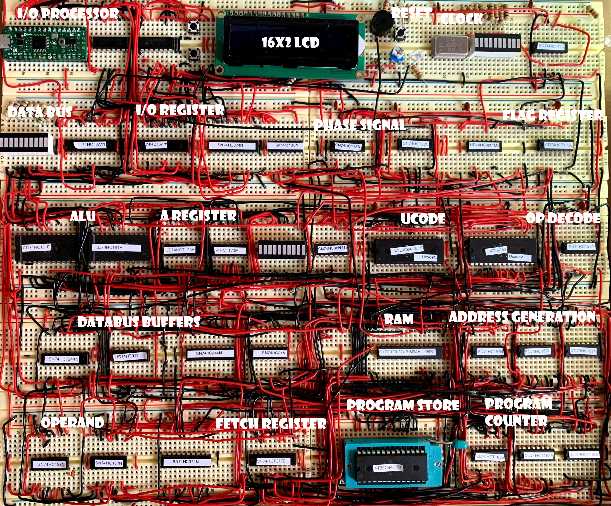

# Hummingbird 8-bit CPU build with 74xx ICs

Hummingbird is a 8 bit 74xx IC based CPU. It is initiated as a clone of
[Nibbler](https://www.bigmessowires.com/nibbler/) on breadboard.
However, the course diverted in the middle due to the difficulty of programming
with separate instruction and data space, see [Havard Architecture](http://www.differencebetween.net/technology/difference-between-von-neumann-and-harvard-architecture/). Also, it is somewhat cumbersome to program on 4 bit CPU.I made a number of significant changes over the original
design and also made it a 8 bit CPU, as a result, the new architecture is named Hummingbird since it is no longer a nibbler.

While some of original project's components are reused and certain components are still derived from Nibbler project.
There are some major extensions. The similarities with the original projects are,
1. Instruction set supports immediate number or memory content as an operand. There is only one register (accumulator).
2. The ALU is largely the same as nibbler, though it is expanded to 8 bit by using 2 cascading 74181 ALU chips.
3. Addressable space is 4096.
4. Ucode design is similar and outputs total 16 control signals.
5. Frogger game from original project is ported (rewritten), and also runs on 16x2 LCD screen. This is likely the only applications for LCD screen and much
   of the new software will be written using terminal interface.
The key differences are,
1. While the size of the addressable space is still 4096, the width of the databus is extended to 8 bit.
2. Switching to Von Neumann architecture. There are a 4Kx8 program store and a 4Kx8 RAM.
   Instructions and data share the same space in RAM. After power-on reset, a built-in bootloader copies the entire
   program store RAM and control transfers to RAM afterwards while the program store is disabled.
3. Expands number of instructions from 16 to 31. The original Nibbler project decoder uses high nibble
   as opcode and restricts the maximum number of instructions to 16. Hummingbird expands to low nibbler when the high nibble
   is 1111.
4. Phase counter is expanded from 1 bit to 4 bits, allows for up to 15 cycles
   to run a single instruction. Supports variable instruction cycles.
5. Supports logic instructions and bit shift/rotate instructions.
6. Supports stack semantics. The first 256 of address space (also called page 0) is used as a stack and it grows from lower address to higher address.
   The memory byte 0 is interpreted as the stack pointer (so that the stack address starts from 1).
7. Instructions took 2 to 16 cycles to complete. There is a 4 bit counter that controls the execution phases.
8. Aside from original projects 16x2 LCD device, the hummingbird also adds a arduino nano based IO processor. It is mainly used for
   user interaction through terminal.

Below is a block diagram of hummingbird CPU: 

Hummingbird instructions is 8 to 24 bit in length and their execution is
controlled by the phase signal. The phase signal counts from 0 to 15, and
phase 0 is always fetch phase. Thus an
instruction may takes from 1 to 16 cycles to complete. The last cycle of
an instruction execuation asserts /phrst to reset phase counter so that the next
instruction can start execute as early as possible.

Some instructions (ADDI, CMPI, NORI) accept immediate operand. The immediate
operand occupies low nibble of an instruction and is sign extended to 8 bit
before sending to the ALU's B input. One exception is the load high (LH) instruction, 
in which casr the
lower nibble is shifted left 4 bits and zeros are appended to the low order
bits to form a 8 bit immediate operand.

There are total of 30 instructions:

| NAME | OP   | FLAGS | Description                                        |     |
| :--  | :--  |  :-:  | :--                                                | :-- |
|      |      |c cflag|| aaa: 12 bit memory address                         |
|      |      |z zflag|| zz: 8 bit memory address starting from 0 (page 0)  |
|      |      |- clear|| II: 8 bit immediate                                |
|      |      |x keep || i: 4 bit immediate, to be sign extended to 8 bit operand || 
| LD   | 0aaa |  -/z  | AREG  <= [aaa] | Load from memory                  |
| ST   | 1aaa |  x/x  | [aaa] <= AREG  | Store to memory                   |
| ADD  | 2aaa |  c/z  | AREG  <= AREG + [aaa] | Add with memory            |
| ADDI | 3i   |  c/z  | AREG  <= AREG + signext(i) | Add immediate         |
| ADDIC| 4i   |  c/z  | AREG  <= AREG + signext(i) | Add immediate with carry |
| SUB  | 5aaa |  c/z  | AREG  <= AREG - [aaa] | Subtract from memory       |
| JMP  | 6aaa |  x/x  | PC    <= [aaa] | Jump                              |
| JC   | 7aaa |  x/x  | PC    <= [aaa] | Jump if cflag else PC + 1         |
| CMP  | 8aaa |  c/z  | AREG + (-[aaa]) | Compare with memory              |
| CMPI | 9i   |  c/z  | AREG + (-signext(i)) | Compare with immediate      |
| NOR  | Aaaa |  -/z  | AREG  <= ~(AREG bitor [aaa]) | Nor with memory     |
| NORI | Bi   |  -/z  | AREG  <= ~(AREG bitor signext(i)) | Nor with immediate |
| AND  | Caaa |  -/z  | AREG  <= AREG bitand [aaa] | Bit and with memory   |
| XOR  | Daaa |  -/z  | AREG  <= AREG xor [aaa] | Bit xor with memory |
| LIH  | Ei   |  -/z  | AREG  <= i shiftleft 4 bitor 0 | Load to high nibble |
| SAVE | F0 II (z=0) |  x/x  | [[0]] <= II [0] <= [0] + 1 | Push immediate II on stack |
| RETURN | F0 (z=1) |  x/x  | [0] <= [0] - 2, PC <= [[0]] | Pop 2 bytes from stack and jump to stack, |
|      |      |       | | where the jump back to caller instruction is built. |
|      |      |       | | Here, both F0 opcode is used for save and return, if |
|      |      |       | | z flag is set, the opcode is treated as return, otherwise, |
|      |      |       | | it is taken as save instruction.                 |
| RESERVED | F1 |     | |                                                  |
| GT   | F2   |  c/-  | cflag = !cflag and !zflag | Set carry if grater than |
| LT   | F3   |  c/-  | cflag = cflag and !zflag  | Set carry if less than |
| EQ   | F4   |  c/-  | cflag = zflag | Set carry if equal to              |
| NE   | F5   |  c/-  | cflag = !zflag | Set carry if not equal to         |
| NC   | F6   |  c/-  | cflag = !cflag | Reverse carry flag                |
| PUSH | F7 zz|  x/x  | [[zz]] <= AREG, [zz] = [zz] + 1 | Push on stack    |
| POP  | F8 zz|  x/x  | [zz] = [zz] - 1, AREG <= [[zz]] | Pop from stack   |
| PEEK | F9 zz II|  x/x  | A <= [[zz] - II] | Peek stack                   |
| SETZ | FA   |  -/z  | z <= 1  | Set zflag                                |
| SHL  | FB   |  -/z  | AREG <= AREG shiftleft 1 | Shift left              |
| SHR  | FC   |  -/z  | AREG <= AREG shiftright 1 | Shift right            |
| ROL  | FD   |  -/z  | A=A shiftleft 1 bitor A[7] | Rotate left           |
| ROR  | FE   |  -/z  | A=A shiftright 1 bitor (A[0]<<8) | Rotate right    |
| ASR  | FF   |  -/z  | | arithmatic shift right by 1 bit                  |

ALU is expanded to 8 bit wide and has 2 input ports. Port A is always
connected to the accumulator (A REG) and port B comes from the data bus.
Two cascading 74181 4bit ALU ICs form the ALU.

The build photo on breadboard is shown 
